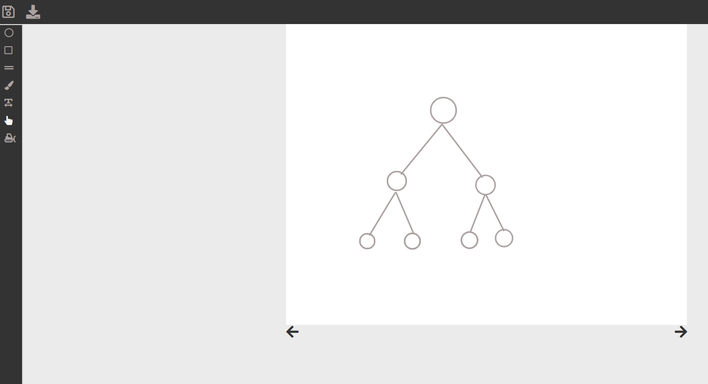
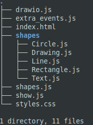

# Drawio_Html_5_canvas
A simple paint program that allows you to draw simple shapes such as a rectangle, circle, free hand draw and more.
Where you can download one painting into local storage of the browser and load it again later, as well as undo and redo actions. 
Made with html5 canvas, and javascript.

## Example

## The code
The structure of the project is using some what of a Object oriented design, where every shape inherits from the Shapes.js file  
where the index.html file contains the html of the project, the styling of the project is contained in the styles.css file.  
drawio.js contains the main functionality of the project, show.js decides what to show when each shape is selected, 
and extra_events.js makes events we are using for the project such as redo and undo functionality.  

